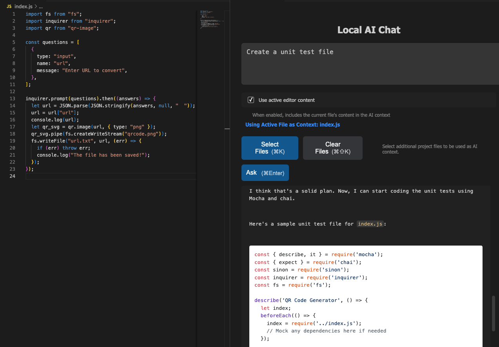

# VSCode Local AI Chat

A Visual Studio Code extension that enables you to use freely available Large Language Models (LLMs) locally on your machine. This extension provides improved privacy, reduced latency, and cost savings by running LLMs directly on your device.



---

## Features

- **Local LLM Integration**: Download and use any LLM supported by [Ollama](https://ollama.com/).
- **Configurable Context**: Select any workspace files or text to add to the prompt context
- **Privacy-First**: All processing happens locally on your machine, ensuring your data remains private.
- **Low Latency**: Eliminates the need for cloud-based APIs, reducing response times.
- **Cost-Effective**: No subscription fees or API costs—run models locally for free.
- **Customizable**: Easily switch between different LLMs via the extension settings.

> **Tip**: The size of the LLM that works on your machine depends on your system's memory. A rough estimate is Maximum Parameters ≈ (RAM in bytes) / (Bytes per parameter).
>
> For 16GB of RAM (≈16×10⁹ bytes) and using 2 bytes per parameter:
> Maximum Parameters ≈ 16×10⁹ / 2 = 8 billion parameters.
> Or just try each model size until you find a size and output speed you find acceptable

---

## Requirements

Before using this extension, ensure you have the following:

1. **Install Ollama**:
   - Download and install Ollama from [https://ollama.com](https://ollama.com/).

2. **Download an LLM**:
   - Visit the [Ollama Model Library](https://ollama.com/library) to find the LLM you want to use.
   - Download the model using the terminal. For example:
     ```bash
     ollama pull deepseek-r1:1.5b
     ```

3. **Default Model**:
   - By default, the extension uses the `deepseek-r1:1.5b` model. If you want to use a different model, update the extension settings.
---

## Usage

1. Open the Command Palette (`Ctrl+Shift+P` or `Cmd+Shift+P` on macOS).
2. Search for and select `Local AI Chat`.
3. A webview panel will open where you can interact with the locally running LLM.

---

## Extension Settings

This extension contributes the following settings:

- **`wassam-localai-ext.localModel`**: Specify the local LLM to use. By default, this is set to `deepseek-r1:1.5b`. Update this setting to use a different model.

To update the settings:
1. Open the VS Code settings (`Ctrl+,` or `Cmd+,` on macOS).
2. Search for `wassam-localai-ext.localModel`.
3. Enter the name of the LLM you want to use (e.g., `llama2` or `mistral`).

---

## Installation
### Using Visual Studio
1. Open Visual Studio Code.
2. Go to the Extensions view by clicking on the Extensions icon in the Activity Bar on the side of the window or pressing `Ctrl+Shift+X`.
3. Search for "Local AI Chat" and install the extension.
4. Reload Visual Studio Code to activate the extension.

### Installing the extension manually
```sh
git clone https://github.com/wassamz/wassam-localai-ext
npm install -g @vscode/vsce
vsce package
```
---

## Release Notes

### 2.0.0 - 2025-03-03
### Added
- **File Picker:** Users can now select one or more files to serve as context for the local AI prompt.
- **Syntax Highlighting:** Code snippets are now displayed with color, leveraging Marked and Highlight.js.

### Improved
- **User Experience:** Minor visual enhancements and new keyboard shortcuts for improved usability. 

### 1.1.1 - 2025-02-05
- **Initial Release**: First version of the Local AI Chat extension with support for locally running LLMs via Ollama.

---

## Feedback and Support

If you encounter any issues or have suggestions for improvement, please [open an issue on GitHub](https://github.com/wassamz/wassam-localai-ext/issues). Your feedback is greatly appreciated!

---

## License

This extension is licensed under the [MIT License](https://opensource.org/licenses/MIT).

---

Enjoy using Local AI Chat! 🚀